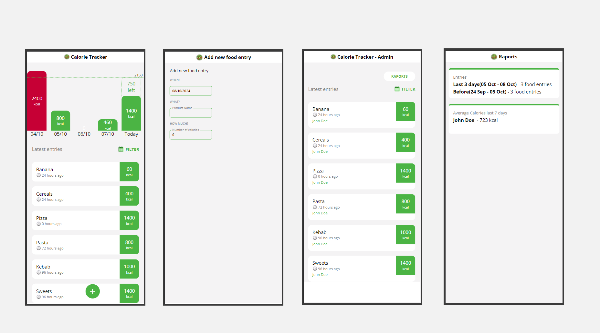

 

## GitHub Calorie Tracker

Ready-to-use tracker for your daily calories written in React Web.

Supports adding meals, editing ,filtering and a custom calorie limit for your plan.

### :sparkles: Highlights

- Modular component-based UI with centralized state management

- Full static typechecking

 

### :page_with_curl: Tech Stack

- [React 18.3.1](https://react.dev/ " React 18.3.1") (with hooks)

- [TypeScript 4.2.4](https://www.typescriptlang.org/ "TypeScript 4.2.4")

- [React Router 6.26.2](https://www.reactrouter.com "React-router-dom 6.26.2")

- [Moment 2.30.1](https://momentjs.com/ "Moment 2.30.1")

 

### :open_file_folder: Installation

1. **Clone the repository**

   `git clone https://github.com/LiviuVisovan3/calorietracker`

1. **Move to project folder**

   `cd github-calorietracker`

1. **Install**

   `npm install`

1. **Start application**

   `npm start`

 
